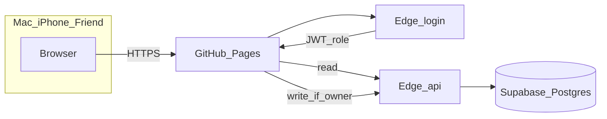

# Finance app: persist, protect, and polish

Keep the current look in [index.html](/Users/prajwal/Documents/mac_project/index.html). Split logic so the site can run on a phone, a Mac, and a shared URL without Numbers.

## Hosting and data (free)

- **GitHub Pages** serves the static site (works on Safari/iPhone and desktop). Share the Pages URL.
- **Supabase free tier** stores expenses, holdings, and trades. Data survives new devices and closing every tab.
- **Two passwords** (your choice, stored only as hashes in Supabase secrets, never in the repo):
  - **Viewer** — can open the site and look; add/edit/delete/buy/sell hidden or disabled.
  - **Owner** — full write.
- Login: one password field. A Supabase Edge Function compares the password and returns a short-lived JWT with `role: viewer | owner`. All table access goes through Edge Functions using the service role **on the server**. Row Level Security denies the public anon key, so the database is not world-readable even though the frontend key is public (normal for Supabase).
- Session kept in `sessionStorage` (must log in again per browser tab set) or `localStorage` with expiry so iPhone does not retype every hour. Owner vs viewer is enforced on every write, not only in the UI.
- Seed current Numbers data once (expenses + holdings you already have in the page). After that, the site is the source of truth.
- You will create a GitHub repo + a Supabase project during implementation. Secrets: `OWNER_PASSWORD_HASH`, `VIEWER_PASSWORD_HASH`. Never commit the service role key.

**Honest limit:** a leaked viewer password lets someone see balances; a leaked owner password lets them change data. Change hashes in Supabase if that happens. This is shared-password security, not bank-grade accounts.

iPhone Shortcuts (GPay / 10am snapshot) stay out of this pass. A later owner `POST` on the same API can plug into Shortcuts.

## App structure

Move from one 1000-line file to:

- [index.html](/Users/prajwal/Documents/mac_project/index.html) — shell, login gate, pages
- `css/app.css` — existing Apple tokens
- `js/finance.js` — pure math (FX, sleeves, SIP/step-up/lumpsum/EMI, buy/sell, realised P/L)
- `js/app.js` — UI, sync, quotes
- `js/finance.test.js` — unit tests (Node)
- `supabase/functions/login` and `supabase/functions/api` — auth + CRUD
- `.github/workflows/test.yml` — run tests on push
- `.env.example` — `SUPABASE_URL` + public anon key only

## UI and product changes (from your list)

**Overview** — two blocks, not one metric row: **Investments** (value, invested, unrealised, day change) and **Spending** (this month, YTD) with their own charts.

**Add expense** — owner-only stepper modal, one question at a time: Today vs pick date → amount → type → category → account → notes → confirm. Same fields as today.

**Delete expense** — trash on each row; confirm dialog with amount + date. No delete without confirm. Viewer cannot delete.

**Portfolio metrics** — drop “Foreign sleeve”. Show Current value, Invested, Unrealised P/L, **Unrealised P/L %**. Add **Realised P/L** (lifetime from sells).

**Table totals** — footer row per sleeve: shares/units, invested, value, unrealised.

**Buy / sell** — owner actions on a holding (or “new buy” for a new symbol).  
- Buy: qty + price (INR, or USD/EUR for foreign) + date; weighted-average cost.  
- Sell: qty + price; cannot sell more than held; realised += `(proceeds_inr - avg_cost_inr * qty)`; remaining qty/cost updated.  
- Keep lots that are already separate (three Nokia rows stay separate unless you sell from a chosen row).

**Calculators** — number field + slider, sliders debounced so they do not re-render every tick. Validation: amount &gt; 0, years ≥ 1, rates in range, not NaN. EMI chart labels: **Principal repaid** / **Interest paid** (not “Est. returns”). SIP/lumpsum keep Invested vs Est. returns. Fix `lineStack` so dataset labels are passed in.

**Remove Numbers** — drop CSV import/export copy, footer about iCloud Numbers, and “Import holdings CSV”.

**Quotes** — keep Yahoo + proxy from the hosted origin (CORS is more likely to work than `file://`).

## Tests

Extract and test in `js/finance.js` (this is the “UT” layer):

- Foreign FX: AT&amp;T `price * shares * USDINR` and Nokia `* EURINR` vs the Numbers market-value-in-rupees examples; cost already in INR.
- Sleeve totals and unrealised %.
- Buy weighted average; sell realised and remaining cost; reject oversell and qty ≤ 0.
- SIP / step-up / lumpsum / EMI formulas and validation errors (0 years, negative amount).

GitHub Action runs `node --test`. No browser E2E in this pass (still no reliable browser automation here); unit tests cover the money logic that is easy to get wrong.

## What you will do once when we build

1. Create GitHub repo, enable Pages.
2. Create free Supabase project, deploy two Edge Functions, paste password hashes.
3. Put Pages URL on the iPhone home screen; give the friend the URL + **viewer** password only.
